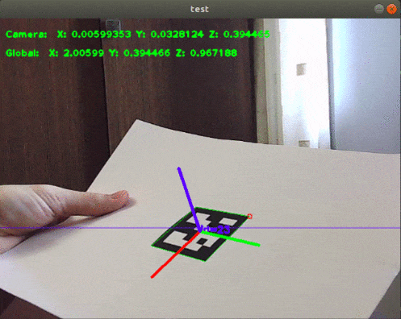

# Multi-cameras calibration task
This repository contains a program that determines the position of the ArUco-marker in three-dimensional space. 



## Requirements
+ opencv >= 3.2.0
+ cmake >= 2.8
## How to build
1. Download this repository: `$ git clone https://github.com/SIZharov/Camera-Calibration.git`
1. Open "cam_calib" folder, and then: `$ cmake . && make` 
## How to run
### Calibration:
Afret you build the project:
`$ ./cam_calib path/to/your/pattern/photo_1.jpg path/to/your/pattern/photo_2.jpg ...`
 
Notise! This code calibrates systems with only 2 cameras. You have to take photos and name them as in this [opencv guide](https://docs.opencv.org/master/d2/d1c/tutorial_multi_camera_main.html). Write PATTERNWIDTH and PATTERNHAIGHT in main.cpp file, to set physical width and height of your pattern. Intrinsic camera matrix and distortion coefficients will be stored in "im_storage/CalibParams".
### Pose estimation:
Afret you build the project:
`$ ./cam_calib path/to/your/marker/photo.jpg`

Notise! This code determines the position of only 1 marker and accepts only 1 photo as input. The resulting coordinates describe the position of the marker in the camera's coordinate system. The data will be saved in "Coordinates. yaml".
## Example
```
$ cd cam_calib/
$ cmake .
$ make
// Intrinsic camera matrix and distortion coefficients of my own camera 
// already stored in "im_storage/CalibParams" by default.
$ ./cam_calib images/test_im2.jpg
```


